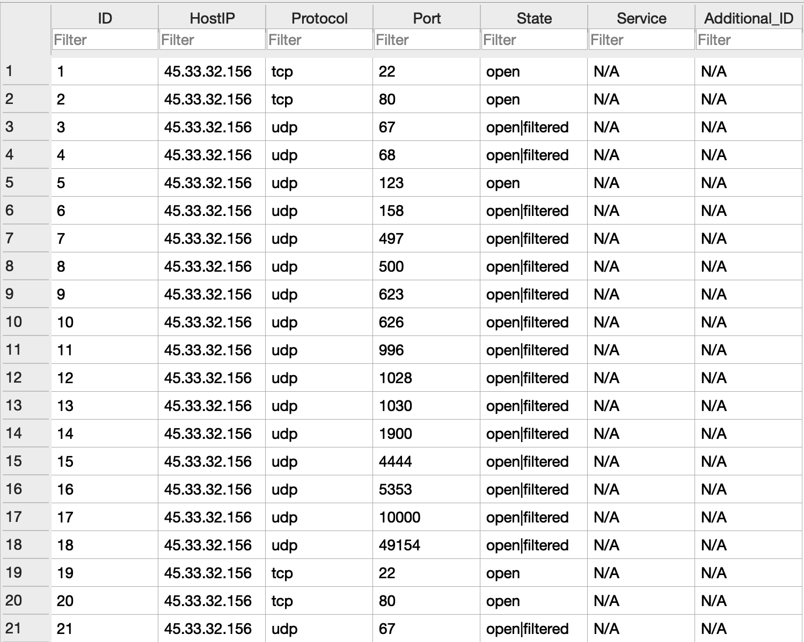

# nmapdb

## What is this?
A solution to needing some high-level visibility into NMAP's XML output.
It creates a SQLite3 database, that can be viewed with any browser of choice.

## How do I use this?
```sh
go get github.com/EspressoCake/nmapdb
$(locate nmapdb) your_NMAP_XML_file.xml
```

## What does the data look like?

